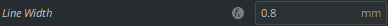
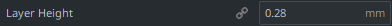
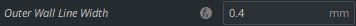
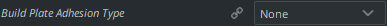

# Recommended Print Settings:
My observations were based on the Ender 3, using Cura, and some of these suggestions will not work universally.
With that in mind, the following are the observations and settings that I found the best when testing the prints.
(images coming soon)
1.
    
    
    Personal opinion: I have found that larger layer width, not smaller, actually feels smoother to the touch. I use
    0.8mm layer width for the top and bottom, even though it leaves gaps in the print...
    don't ask me why it just feels nice.
2. 
    
    
    Layer height has no effect on the quality of the print, as all important measurements are horizontal, not vertical,
    so I use 0.28mm.
3. 
    
    
    with the way the model is currently, the keycap will not fit on the switch unless the outer wall print width is
    <= 0.4mm. I might try to change the model in the future to handle print width larger than 0.4mm, but for now that's
    a requirement.
    If you print the model without changing anything on cura, this is the default setting, so you should be good.
4.  
    

    You most likely only need 2 layers of wall and 2 layers of floor/roof on your print. also, you should only need 10%
    to 30% infil. The only important variable is whether the infil creates sufficient support for the layers above it.
    The plastic is strong enough to handle far more than you pressing each key even at 10% infil.
5.  If you do plan on making the print as fine as possible, the smallest sizes I could successfully print with it sticking to the print bed was 0.2mm layer height and 0.3mm layer width. keep in mind you can create specific variables for the first layer, and for top/bottom of the print.
6.  
    
    
    personal opinion: you don't need any kind of build plate adhesion. It just wastes plastic. 
7.  
    
    
    I find that with the settings I've mentioned above, lines feels the best, but if you want each keycap to be
    symmetrical you might want to try 'concentric' instead.